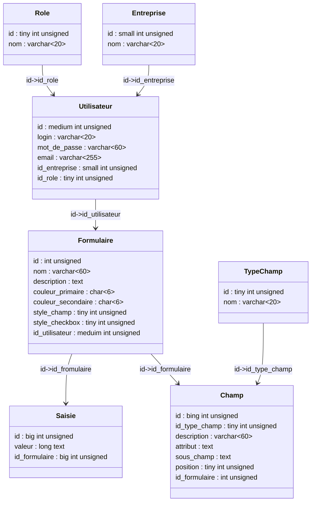

# Ramina-Form-Creator
Site web de création et de mise en ligne de formulaire personnalisé

## Structure de la base de données

```mermaid
    classDiagram
    direction TB
    Role --> Utilisateur : id->id_role
    Entreprise --> Utilisateur : id->id_entreprise
    Utilisateur --> Formulaire : id->id_utilisateur
    Formulaire --> Saisie : id->id_fromulaire
    Formulaire --> Champ : id->id_formulaire
    TypeChamp --> Champ : id->id_type_champ
    class Utilisateur{
        id : medium int unsigned
        login : varchar~20~
        mot_de_passe : varchar~60~
        email : varchar~255~
        id_entreprise : small int unsigned
        id_role : tiny int unsigned
    }
    class Role{
        id : tiny int unsigned
        nom : varchar~20~
    }
    class Entreprise{
        id : small int unsigned
        nom : varchar~20~
    }
    class TypeChamp{
        id : tiny int unsigned
        nom : varchar~20~
    }
    class Formulaire{
        id : int unsigned
        nom : varchar~60~
        description : text
        couleur_primaire : char~6~
        couleur_secondaire : char~6~
        style_champ : tiny int unsigned
        style_checkbox : tiny int unsigned
        id_utilisateur : meduim int unsigned
    }
    class Champ{
        id : bing int unsigned
        id_type_champ : tiny int unsigned
        description : varchar~60~
        attribut : text
        sous_champ : text
        position : tiny int unsigned
        id_formulaire : int unsigned
    }
    class Saisie{
        id : big int unsigned
        valeur : long text
        id_formulaire : big int unsigned
    }
```
